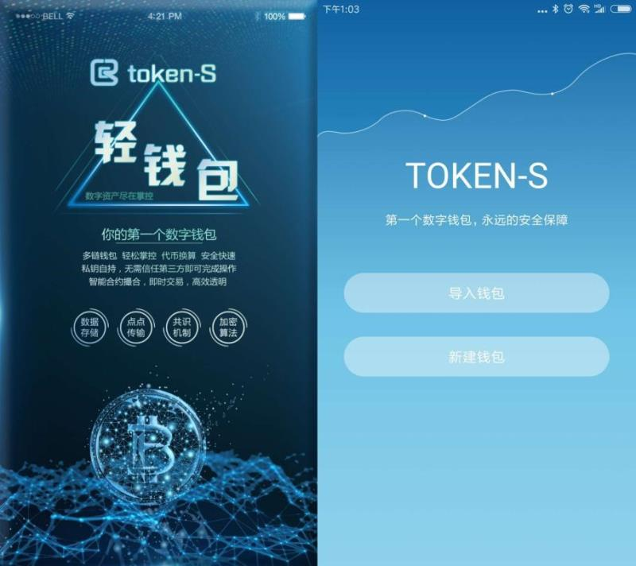
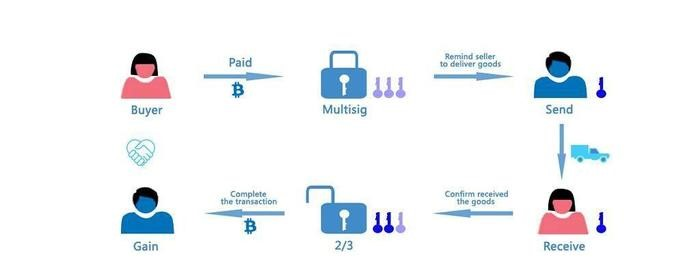

# 
**白皮书**

### 

 
## 
更安全的去中心化电子现金体系

### 
v1.0

### 
**Github**:[https://github.com/wabei](https://github.com/wabei)

### 
2018年7月
  

<!-- TOC -->

## 目录
- [概要](#概要)
- [一、比特币系统的不安全因素](#1-比特币系统的不安全因素)
    - [1.1 比特币挖矿](#11-比特币挖矿)
    - [1.2 算力集中化](#12-算力集中化)
    - [1.3 私钥丢失的风险](#13-私钥丢失的风险)
- [二、双链](#2-双链)
    - [2.1 账户](#21-传统金融行业的IT基础设施痛点)
    - [2.2 挖矿](#22-挖矿)
    - [2.3 反池技术](#23-反池技术)
    - [2.4 wabash引擎](#24-安全引擎)
- [三、钱包](#3-token-S钱包)
    - [3.1 智能检测，安全风险超前预警](#31-智能检测，安全风险超前预警)
    - [3.2 多重签名](#32-多重签名)
    - [3.3 冷钱包 ](#33-冷钱包 )
    - [3.4 全球顶级专业防欺诈系统，打造安全、合规、高信用交易平台](#35-全球顶级专业防欺诈系统，打造安全、合规、高信用交易平台)
    - [3.5 抗量子加密](#36-抗量子加密)
    - [3.6 量子加密探索](#37-量子加密探索)
    - [3.7 多链钱包、全币种一站式管理](#38-多链钱包、全币种一站式管理)
- [四、其他](#4-其他)
    - [4.1 公链应用](#41-公链应用)
    - [4.2 发行](#42-发行)
    - [4.3 结论：更加安全的去中心化电子现金体系](#43-结论：更加安全的去中心化电子现金体系)
- [关于我们](#关于我们)

<!-- /TOC -->

## 概要   
中本聪设计比特币的目的，就是希望能够实现一种完全基于点对点网络的电子现金系统，在没有任何资产担保、内在价值或者中心发行者的情况下维持着价值，并使在线支付能够直接由一方发起并支付给另外一方，中间不需要通过任何的中介机构。总结来说，他希望比特币能够实现以下这些目标： 
  
1、不需要中央机构就可发行货币  
  
2、不需要中介机构就可完成支付  
  
3、保持使用者匿名  
  
4、交易无法被撤销  
  
从电子现金系统的角度来看，以上这些目标在比特币系统中基本都得到了实现。但随着比特币市场的迅速发展，也出现了一些新的安全问题，比如算力集中化、交易账户安全、比特币永久丢失导致流通量减小等。于是建立一种没有上述风险的更加安全的电子现金系统就成了双公链（下述2条独立运行的公链幸福公链与树贝公链简称：双公链）的设计初衷。  
  
最大的威胁来自于算力的集中化，比特币挖矿算法基于一种名为SHA-256的加密算法，在挖矿过程中，矿工将比特币的80个字节长度的区块头数据进行两次SHA256运算，运算结果就是一个256位（32字节）长度的字符串。通过比较与当前难度值的大小判断当前区块是否合法。然而，这种挖矿算法容易被中心化攻击。目前挖矿生态系统被专门设计的因而在比特币挖矿这一特殊任务上效率提高上千倍的ASICs（专用集成电路）和电脑芯片控制。这意味着比特币挖矿不再是高度去中心化的和追求平等主义的，而是需要巨额资本的有效参与。  
   
电子现金系统之外，比特币技术还有另外一层含义，区块链怎样应用于货币以外的领域。但比特币的智能合约缺少图灵完备，这限制了它在各行各业的应用。双公链的目标就是提供一个带有内置的成熟的图灵完备语言的区块链系统，用这种语言可以创建合约来编码任意状态转换功能，只要简单地用几行代码来实现逻辑，就能够创建以上提及的所有系统以及许多我们还想象不到的的其它系统。  
  
## 一、比特币系统的不安全因素 
去中心化的数字货币概念，早在几十年以前就被提出来了。1974年诺贝尔经济学奖获得者弗里德里希·冯·哈耶克《货币的非国家化》就是这一思想的集中体现。但由于市场、技术、模式等方面的限制，直到中本聪提出比特币概念，去中心化的数字货币才逐渐流行开来。  
  
中本聪引入这样一个理念：将一个非常简单的基于节点的去中心化共识协议与工作量证明机制结合在一起。节点通过工作量证明机制获得参与到系统的权利，每十分钟将交易打包到“区块”中，从而创建出不断增长的区块链，拥有大量算力的节点有更大的影响力。尽管比特币区块链模型非常简陋，但实践证明它已经足够好用了。  
  
目前比特币已经是全球最主流的数字货币，拥有千万甚至上亿的持有者、数以千计的矿池、上万种以比特币系统为基础的应用。但市场也在考验着比特币系统，不断地为其创造新的问题。  
    
### 1.1 比特币挖矿  
  
前文已经提到，作为一种去中心化的数字现金系统，比特币将一个基于节点的去中心化共识协议与工作量证明机制结合在一起。比特币的去中心化共识进程要求网络中的节点不断尝试将交易打包成“区块”。网络被设计为大约每十分钟产生一个区块，每个区块包含一个时间戳、一个随机数、一个对上一个区块的引用（即哈希）和上一区块生成以来发生的所有交易列表。这样随着时间流逝就创建出了一个持续增长的区块链，它不断地更新，从而能够代表比特币账本的最新状态。依照这个范式，检查一个区块是否有效的算法如下：  
   
1、检查区块引用的上一个区块是否存在且有效。  
  
2、检查区块的时间戳是否晚于以前的区块的时间戳，而且早于未来2小时。  
  
3、检查区块的工作量证明是否有效。  
  
4、将上一个区块的最终状态赋于S[0]。  
  
5、假设TX是区块的交易列表，包含n笔交易。对于属于0……n-1的所有i,进行状态转换S[i+1] = APPLY(S[i],TX[i])。如果任何一笔交易i在状态转换中出错，退出程序，返回错误。返回正确，状态S[n]是这一区块的最终状态。  
  
区块验证算法的有趣部分是“工作量证明”概念：对每个区块进行SHA256哈希处理，将得到的哈希视为长度为256比特的数值，该数值必须小于不断动态调整的目标数值。工作量证明的目的是使区块的创建变得困难，从而阻止女巫攻击者恶意重新生成区块链。因为SHA256是完全不可预测的伪随机函数，创建有效区块的唯一方法就是简单地不断试错，不断地增加随机数的数值，查看新的哈希数值是否小于目标数值。如果当前的目标数值是2^192，就意味着平均需要尝试2^64次才能生成有效的区块。一般而言，比特币网络每隔2016个区块重新设定目标数值，保证平均每十分钟生成一个区块。为了对矿工的计算工作进行奖励，每一个成功生成区块的矿工有权在区块中包含一笔凭空发给他们自己12.5BTC的交易。另外，如果交易的输入大于输出，差额部分就作为“交易费用”付给矿工。  
  
因为比特币的密码学基础是非常安全的，所以攻击者会选择攻击没有被密码学直接保护的部分：交易顺序。攻击者的策略非常简单：为了更好地理解挖矿的目的，让我们分析比特币网络出现恶意攻击者时会发生什么。  
  
1、向卖家发送100BTC购买商品（尤其是无需邮寄的电子商品）。  
  
2、等待直至商品发出。  
  
3、创建另一笔交易，将相同的100BTC发送给自己的账户。  
  
4、使比特币网络相信发送给自己账户的交易是最先发出的。  
  
一旦步骤（1）发生，几分钟后矿工将把这笔交易打包到区块，假设是第270000个区块。大约一个小时以后，在此区块后面将会有五个区块，每个区块间接地指向这笔交易，从而确认这笔交易。这时卖家收到货款，并向买家发货。因为我们假设这是数字商品，攻击者可以即时收到货。现在，攻击者创建另一笔交易，将相同的100BTC发送到自己的账户。如果攻击者只是向全网广播这一消息，这一笔交易不会被处理。矿工会运行状态转换函数APPLY(S,TX)，发现这笔交易将花费已经不在状态中的UTXO（未花费的交易输出，Unspent Transaction Output）。所以，攻击者会对区块链进行分叉，将第269999个区块作为父区块重新生成第270000个区块，在此区块中用新的交易取代旧的交易。因为区块数据是不同的，这要求重新进行工作量证明。另外，因为攻击者生成的新的第270000个区块有不同的哈希，所以原来的第270001到第270005的区块不指向它，因此原有的区块链和攻击者的新区块是完全分离的。在发生区块链分叉时，区块链长的分支被认为是诚实的区块链，合法的的矿工将会沿着原有的第270005区块后挖矿，只有攻击者一人在新的第270000区块后挖矿。攻击者为了使得他的区块链最长，他需要拥有比除了他以外的全网更多的算力来追赶（即51%攻击）。  
    
### 1.2 算力集中化  
  
理论上，个人或单个组织很难拥有比全网更多的算力来破坏比特币系统的运行。但由于市场原因（大矿池的收益相对来说更加稳定，小矿池的收益往往显示出很大的波动性）以及比特币ASICs矿机的流行，算力集中化趋势不可避免，资本有实力也有意愿去构建大型矿池。目前全球前三大矿池占据了全网约 48%的算力。  
  
更严重的事故发生在2013年11月,比特币矿池GHash.io对赌博网站BetCoin Dice进行多次付款欺诈。康奈尔大学研究表明，自2014年，6月3日以来，GHash已经达成了至少5次超过51%的加密散列运算量。在其中某个时期，这一过程甚至持续了12个小时。   
   
### 1.3 私钥丢失的风险  
  
尽管比特币的密码学基础是非常安全的，无法被暴力破解，同时控制全网51%的算力也存在一定难度，但这并不意味着黑客就没有办法盗取比特币。在一个比特币账户中，有一组34个字符的比特币地址，可以用来接收比特币，并且每个地址都有一个相关的64个字符的私钥，可以使用它来发送比特币。因此当某人拥有比特币时，他们实际上拥有的是用于解锁区块链上特定地址的私钥。这些秘钥可以在线存储，也可以离线存储，它们都有一定的安全级别。私钥必须被安全地管理好，只有你签署一笔转账时才需要用到，比特币地址可以自由地分发到全世界。这就是比特币钱包的原理。当你的私钥是安全的，那么一切都好，如果你失去了你的私钥，那么你的所有资金都没有了。  
  
通常黑客们会用键盘记录、钓鱼软件、货币木马等方式盗取用户的私钥。键盘记录恶意软件会记录用户的按键并将其内容全部发送给黑客，完整的检测到这些恶意程序几乎是不可能的，这些程序往往兼容移动与PC端，而你根本没有注意到，他们会复制你输入的每一个seed、密码和PIN码，最终成功破解比特币交易网站后台；钓鱼APP会伪造成官方应用程序，通常使用官方标识和现有比特币钱包等信息来欺骗用户，窃取比特币；货币木马则会在感染电脑后会不断扫描用户粘贴板中的内容，当用户复制虚拟货币的支付地址时，该病毒会自动修改粘贴板中的支付地址信息，从而给大意的用户造成损失。  
  
根据公开信息，被盗的比特币数量约为200万枚，占比特币总发行量的9.5%，并且这一数字还在不断增长。最新的例子是，2018年4月13日，印度比特币交易所Coinsecure平台，被黑客窃取了438个比特币，当时价值330万美元。  
  
## 二、双公链 
  
双公链=幸福公链+汉源公链，俩条公链独立平行运行，目的是创建更加安全的去中心化电子现金系统及安全的可靠的公共溯源平台，它基于密码学原理而不基于机构信用，不仅可以使得任何达成一致的双方，能够直接进行支付，从而不需要第三方中介；并且还能有效的预防算力的中心化，最大程度较少对大型矿池的依赖。  
   
### 2.1 传统金融行业的IT基础设施痛点  
  
在双公链系统中，状态是由被称为“账户”（每个账户由一个20字节的地址）的对象和在两个账户之间转移价值和信息的状态转换构成的。瓦贝公链的账户包含四个部分：  
  
1、随机数，用于确定每笔交易只能被处理一次的计数器  
  
2、账户目前的余额  
  
3、账户的合约代码，如果有的话  
  
4、账户的存储（默认为空）  
  
（hap、hsc)是双公链内部的主要加密燃料，用于支付交易费用。一般而言，双公链有两种类型的账户：外部所有的账户（由私钥控制的）和合约账户（由合约代码控制）。外部所有的账户没有代码，人们可以通过创建和签名一笔交易从一个外部账户发送消息。每当合约账户收到一条消息，合约内部的代码就会被激活，允许它对内部存储进行读取和写入，和发送其它消息或者创建合约。  
  
### 2.2 挖矿  
  
虽然有一些不同，但双公链的区块链在很多方面类似于比特币区块链。它们的区块链架构的不同在于，双公链块不仅包含交易记录和最近的状态，还包含区块序号和难度值。双公链中的区块确认算法如下：   
  
1、检查区块引用的上一个区块是否存在和有效。   
  
2、检查区块的时间戳是否比引用的上一个区块大，而且小于15分钟。  
  
3、检查区块序号、难度值、 交易根，叔根和燃料限额（许多瓦贝公链特有的底层概念）是否有效。  
   
4、检查区块的工作量证明是否有效。  
  
5、将S[0]赋值为上一个区块的STATE_ROOT。  
  
6、将TX赋值为区块的交易列表，一共有n笔交易。对于属于0……n-1的i，进行状态转换S[i+1] = APPLY(S[i],TX[i])。如果任何一个转换发生错误，或者程序执行到此处所花费的燃料（gas）超过了GASLIMIT，返回错误。  
  
7、用S[n]给S_FINAL赋值, 向矿工支付区块奖励。  
  
8、检查S-FINAL是否与STATE_ROOT相同。如果相同，区块是有效的。否则，区块是无效的。  
  
这一确认方法乍看起来似乎效率很低，因为它需要存储每个区块的所有状态，但是事实上双公链的确认效率可以与比特币相提并论。原因是状态存储在树结构中（tree structure），每增加一个区块只需要改变树结构的一小部分。因此，一般而言，两个相邻的区块的树结构的大部分应该是相同的，因此存储一次数据，可以利用指针（即子树哈希）引用两次。一种被称为“帕特里夏树”（“Patricia Tree”）的树结构可以实现这一点，其中包括了对默克尔树概念的修改，不仅允许改变节点，而且还可以插入和删除节点。另外，因为所有的状态信息是最后一个区块的一部分，所以没有必要存储全部的区块历史-这一方法如果能够可以应用到比特币系统中，经计算可以对存储空间有10-20倍的节省。  
  
### 2.3 反池技术  
  
比特币挖矿算法基本上是让矿工千万次地轻微改动区块头，直到最终某个节点的改动版本的哈希小于目标值。然而，这种挖矿算法容易被两种形式的中心化攻击。第一种，挖矿生态系统被专门设计的因而在比特币挖矿这一特殊任务上效率提高上千倍的ASICs（专用集成电路）和电脑芯片控制。这意味着比特币挖矿不再是高度去中心化的和追求平等主义的，而是需要巨额资本的有效参与。第二种，大部分比特币矿工事实上不再在本地完成区块验证；而是依赖中心化的矿池提供区块头。目前，最大的三个矿池间接地控制了大约全网48%的算力。  
  
双公链现在的目的是使用一个基于为每1000个随机数随机产生唯一哈希的函数的挖矿算法，用足够宽的计算域，去除专用硬件的优势。简而言之，双公链的挖矿算法运算时需要依赖大量内存（相比之下，运行SHA256算法的比特币ASIC矿机不需要那么多内存，因此其性能仅受限于其处理器），通常，在高带宽总线上转移数据时这些算法的性能会受限，这使得它很难被ASIC化。这样的策略当然不会使中心化的收益减少为零，但是也不需要。注意每单个用户使用他们的私人笔记本电脑或台式机就可以几乎免费地完成一定量的挖矿活动，但当到了100%的CPU使用率之后更多地挖矿就会需要他们支付电力和硬件成本。ASIC挖矿公司需要从第一个哈希开始就为电力和硬件支付成本。所以，如果中心化收益能够保持在(E + H) /E 以下，那么即使ASICs被制造出来普通矿工依然有生存空间。另外，我们计划将挖矿算法设计成挖矿需要访问整个区块链，迫使矿工存储完成的区块链或者至少能够验证每笔交易。这去除了对中心化矿池的需要；虽然矿池依然可以扮演平滑收益分配的随机性的角色，但这功能可以被没有中心化控制的P2P矿池完成地同样好。这样即使大部分普通用户依然倾向选择轻客户端，通过增加网络中的全节点数量也有助于抵御中心化。  
  
另外，我们拟对于已形成的，占比全网算力超过48%的区域，触发区域算力定位限制 ，即对区域节点物理间隔限制节点增加，算力过度集中的区域将迫于管理成本上升而放弃扩张，从而实现整个网络动态平衡。  

图3-1 比特币算力分布图

### 2.4 wabash 安全引擎
 
1. 存在一个种子, 可以通过块高度直到该点来计算每个块。
2. 从种子, 你可以计算一个 16 MB 的伪随机缓存, 用于轻客户端存储缓存。
3. 从缓存中, 我们可以生成一个 2 GB 的数据集, 该属性表示数据集中的每个项只依赖于缓存中的少量项。完整的客户和矿工存储这个数据集。数据集会随时间线性增长。挖矿涉及抓取数据集的随机切片并将它们一起哈希。可以通过使用缓存来重新生成所需的数据集的特定部分, 从而低内存的机器可以进行验证, 因为只需存储缓存即可验证。完整的大数据集每隔30000块更新一次, 因此大多数矿工的工作将是读取数据集, 而不是对其进行更改。这使得普通电脑挖矿成为可能，使得整网络算力更加均衡。
4. 高带宽需求意味着从堆在很多超速处理单元、分享同样内存的加速在每个单独的单元给出很少的利益，通过阻止专用芯片共享内存的方式，降低矿机的作用，达到反ASIIC去中心化目的,为账本安全提供支持。

   
## 三、钱包  
  
双公链提供了一个去中心化的钱包系统——Token-S，Token-S数字资产管理平台里的钱包、私钥都由本地生成，助记词本地加密存储，本地离线签名交易，完全去中心化，最大程度阻止了互联网上黑客的攻击。此外Token-S还有如下安全特性。  

图4-1 token-S轻钱包

  
### 3.1 智能检测，安全风险超前预警   
  
用户首次登陆Token-S钱包，会有针对用户手机设备的智能检测，排查设备是否具有安全风险，提前预警。同时，在初次创建钱包，需设置密码，密码支持不低于 6 位的任意混合字符加密。创建的密码将用于不卸载APP情况下找回助记词、发送数字货币。密码不设置找回功能，需要用户牢记密码，密码加密保存于用户本地手机内，而非存放于服务器，完全由用户控制。  
  
### 3.2 多重签名
  
为了应对黑客盗取私钥的行为，一个简单有效的办法是多重签名。传统的比特币账户中，你的比特币地址中每一个地址都有一个对应的私钥。而多重签名地址，可以有多个相关联的私钥，你需要其中的两个才能完成一笔转账。实际上，你也可以设置成1/3，5/5，6/11，但是最常见的是2/3的组合，这些都是通过图灵完备的合约层完成，合约使用的sol语言，具有高度扩展性。可以满足多账户签名和日最大限额转出控制，一旦合约部署后，任何人无法篡改，假设一个双私钥管理的账户中的每个私钥都被黑客获取，那么他也只能转走日限额范围内的数额，当主人发现后可立刻中止损失。幸福公链接用于锁仓的在线钱包链接：htt://hwallet.bitwa.org.在线钱包的使用需要按照：https://github/wabei/hap-miner 中的操作说明进行，核心的操作是需要从控制台解锁，才能在网页上操作，这样做的目的也是为了保护用户隐私。

图5-1 2/3模式的多重签名

在线钱包中，2组以上的私钥分别独立存放于不同地点，为了保证钱包安全，钱包UTC文件不允许放置于同一地点，否则转账不成功。这样就算任意一个客户端节点被攻破，资金仍然安全。在线钱包是典型的热钱包，与之对应的是冷钱包机制，Token-s接替了这个任务。  
  
### 3.3 冷钱包   
  
   冷钱包是指用户在其他隔离网络的设备上完成签名，再通过通过热钱包应用扫描签名文件发送签名完成交易，私钥只保存在冷钱包中，这一机制保障了私钥永远不触碰网络。一般用户需要有一部不联网的终端并在其上按安装Token-s2.0,签名后会直接生成二维码电子图片，用户可以使用另一部联网的终端设备的token-S扫描离线终端的签名二维码完成在线发送交易。  
  
### 3.4 全球顶级专业防欺诈系统 打造安全、合规、高信用交易平台  
  
Token-S采用全球顶级专业防欺诈系统，打造安全、合规、高信用交易平台，交易的数字资产可追溯，资产的来源和去处可查，防止欺诈，每一笔交易信息都可以通过交易hash查询，查询浏览器：http://www.hapexplorer.com ;同时，Token-S钱包为了保障用户数字资产安全，将逐步增加了指纹、语音、图案、静脉解锁及复合解锁功能，保证安全的同时使用也更为便捷。  
  
### 3.5 抗量子加密系统  
  
为了用户资金安全，Token-S拟将矿工打包查余通道限制，形成追溯隔离机制。首先在矿工打包需要查余时，矿工只能知道交易是否符合规则（比如账户余额与即将发生的支出的大小对比），但不能知道具体数额（保护用户隐私）。
此外，现代社会对互联网的高度依赖，人们不得不把一些重要私人信息和行为习惯放到互联网上，大数据带了的安全风险不容忽视，如果黑客获得了大量的用户行为痕迹，破解一个人的账户或许用不了那么长时间，而量子计算机的问世，给加密领域带来了新的挑战。目前已知的RSA加密算法已被量子计算机破译，双链采用Secp256K1非对称加密算法，由于他的技术特点，目前还没有找到破解的方法，密码学领域认为15年内不可能有人破解，彻底做到这一点是极其复杂而艰巨的。  
    Secp256k1是指比特币中使用的ECDSA(椭圆曲线数字签名算法)曲线的参数，并且在高效密码学标准（Certicom Research，http://www.secg.org/sec2-v2.pdf）中进行了定义。
    
    
图3-5 椭圆曲线图
  
    Secp256k1为基于Fp有限域上的椭圆曲线，由于其特殊构造的特殊性，其优化后的实现比其他曲线性能上可以特高30％，有明显以下两个优点：
    1）占用很少的带宽和存储资源，密钥的长度很短。
    2）让所有的用户都可以使用同样的操作完成域运算。
椭圆曲线数字签名算法(ECDSA)
用户的密钥对:
（ d, Q ）
待签名的信息： M
签名：
签名过程：
1）根据ECC算法随机生成一个密钥对
2）令
如果r = 0，则返回步骤1
3）计算
4）按照数据类型转换规则，将H转化为一个big endian的整数e
5）
若s = 0, 则返回步骤1
6）输出的
即为签名。
验证过程：
1） 计算
2）按照数据类型转换规则，将H转化为一个big endian的整数e
3）计算
4）计算
如果R = 零点，则验证该签名无效
5）令
6）若 v == r，则签名有效，若 v ≠ r, 则签名无效。
0×01 Secp256k1椭圆曲线
Secp256k1椭圆曲线形如:
椭圆曲线域参数由单元T =（p，a，b，G，n，h）指定 
上图是一个椭圆曲线的示例，类似于比特币所用的曲线。
比特币使用了secp256k1标准所定义的一条特殊的椭圆曲线和一系列数学常数。该标准由美国国家标准与技术研究院（NIST）设立。secp256k1曲线由下述函数定义，该函数可产生一条椭圆曲线：
y2 = (x3 + 7)} over (Fp)
或
y2 mod p = (x3 + 7) mod p
上述mod p（素数p取模）表明该曲线是在素数阶p的有限域内，也写作Fp，其中p = 2256 – 232 – 29– 28 – 27 – 26 – 24 – 1，这是一个非常大的素数。
因为这条曲线被定义在一个素数阶的有限域内，而不是定义在实数范围，它的函数图像看起来像分散在两个维度上的散点图，因此很难画图表示。不过，其中的数学原理与实数范围的椭圆曲线相似。作为一个例子，下图显示了在一个小了很多的素数阶17的有限域内的椭圆曲线，其形式为网格上的一系列散点。而secp256k1的比特币椭圆曲线可以被想象成一个极大的网格上一系列更为复杂的散点。

图3-6 椭圆曲线图2
  
图为：椭圆曲线密码学F(p)上的椭圆曲线，在椭圆曲线的数学原理中，有一个点被称为“无穷远点”，这大致对应于0在加法中的作用。计算机中，它有时表示为X = Y = 0（虽然这不满足椭圆曲线方程，但可作为特殊情况进行检验）。 还有一个 + 运算符，被称为“加法”，就像小学数学中的实数相加。给定椭圆曲线上的两个点P1和P2，则椭圆曲线上必定有第三点 P3 = P1 + P2。
几何图形中，该第三点P3可以在P1和P2之间画一条线来确定。这条直线恰好与椭圆曲线上的一点相交。此点记为 P3'=(x，y)。然后，在x轴做映射获得 P3=(x，-y)。
下面是几个可以解释“无穷远点”之存在需要的特殊情况。 若 P1和 P2是同一点，P1和P2间的连线则为点P1 的切线。曲线上有且只有一个新的点与该切线相交。该切线的斜率可用微分求得。即使限制曲线点为两个整数坐标也可求得斜率！在某些情况下（即，如果P1和P2具有相同的x值，但不同的y值），则切线会完全垂直，在这种情况下，P3 = “无穷远点”。若P1就是“无穷远点”，那么其和 P1 + P2= P2。类似地，当P2是无穷远点，则P1+ P2 = P1。这就是把无穷远点类似于0的作用。
事实证明，在这里 + 运算符遵守结合律，这意味着(A+B)C = A(B+C)。这就是说我们可以直接不加括号书写 A + B + C，而不至于混淆。
   我们已经定义了椭圆加法，为扩展加法下面我们对乘法进行标准定义。给定椭圆曲线上的点P，如果k是整数，则 kP = P + P + P + …+ P（k次）。注意，k被有时被混淆而称为“指数”
   这是目前经典密码学领域最杰出的成就之一，但我们试问这样的算法就真的绝对安全的了吗？如果为了破解一个私钥，需要目前全世界最顶级的经典计算机运行65年才能破解，所以以目前的技术条件黑客去破解这样的密钥系统是没有动力的，因为作恶成本远高于收益。但因此说ECDSA是绝对安全的，是欠妥当的，一个10比特的量子计算机可以轻易破解RSA公钥加密算法，ESDSA本质上和RSA类似，都属于复杂度密码体系，如果有量子计算机达到100qbit处理能力，遍历曲线坐标，对号入座完成破解不会超过15分钟。为了防患于未然，我们不能等到15年再去研发对应的反量子破解算法，我们利用量子力学原理和借鉴前人在量子加密领域的成就启动了量子加密算法的系统测试，一旦测试成熟在征得社区一致的情况下我们随时可以切换密码系统,这样一来即使大规模商用量子计算机到来也无妨系统安全。
   
### 3.6 量子加密探索
量子密码系统不依赖于数学复杂度，而是通过物理学中的量子测不准和不可复制性的物理天然特性来保障，已经被证明无条件安全性，即使量子计算机也不能攻破。幸福链量子加密测试中以量子指纹签名算法为基础签名算法。量子指纹签名算法所使用的量子指纹函数是量子单向函数的一种，密钥分发采用BB84或BBM92协议（这方面的技术成熟度较高）。本白皮书中就幸福公链采用的量子单向函数介绍给大家：经典单向函数的概念是映射f(i):i-->O,对于任意输入i，i属于特定集合 ,得出f(i)容易计算，但使用f(i)推导出i异常困难，i可以简单理解为区块链接中的私钥，f(i)则可以理解为公钥地址；基于经典的单向函数，我们可以构建幸福公链的量子单向函数，即输入长度为L的经典比特串K,输出N个量子位的量子态|f(k) >,其中L>>N,映射K——>f(k)>易于计算，但求逆确不可能（只要发送者不主动交出自己K），因为求逆所需要的qbit仅为经典比特数量上限，k的状态集大小可能为2的2的N次方，同时其满足海森堡的测不准和量子不可复制性，量子单向函数是各类量子密码协议的基石。幸福公链所使用量子指纹（QFP)技术亦是如此，使用量子指纹技术可以将10的20次方经典比特信息压缩为70个量子比特水平，可以极大的提高幸福公链的安全验证速度。量子纠缠的制备终端及用户发送设备及量子矿机也将成为幸福公链的研发项目之一。

### 3.7 多链钱包、全币种一站式管理  
Token-S去中心化钱包通过助记词或私钥，可导入创建多个钱包。支持幸福链、汉源链，树贝链钱包及多种货币，极大的降低了数字货币的使用门槛和管理负担，有效促进了数字资产的灵活应用。  
  
## 四、其他  
  
### 4.1 公链应用  
  
首先要申明的是，双公链之一，汉源链虽具有公链的全部特征，但其构建在中国合法的框架下，将不公开发行代币，其数字货币将做为普通积分用途，用于技术激励、交易上传、消费激励。而幸福链构建在新加坡合法的法律框架之上，将在全球发行数字货币及其价值理念的推广。

幸福公链除了提供更加安全的电子现金系统服务，另一大目的是，使得开发者能够创建任意的基于共识的、可扩展的、标准化的、特性完备的、易于开发的和协同的应用。公链通过建立终极的抽象的基础层-内置有图灵完备智能编程语言的区块链-使得任何人都能够创建合约和去中心化应用，并在其中设立他们自由定义的所有权规则、交易方式和状态转换函数。 

关键字一：STO

我们希望可以使用区块链数字货币技术构造一个由发行者自主，符合市场价值投资理念和监管要求的公共价值投资体系。这个价值投资体系区别于传统的自上而下的公司制度、股票发行制度，而是自下而上的消费投资体系，它的主动权利应该属于消费大众，而不是垄断资本，这与中本聪的本意不谋而合，中本聪创立比特币是希望探索建立去中心化的电子现金体系（自建信任的体系，无需第三方增信），但十年过去了，美联储还是美联储，华尔街的贪婪有增无减，即使在数字货币行业也是乱象横行,依靠讲故事而不实际落地应用的ICO圈钱案例比比皆是。人们的货币自主权仍没有什么变化，显然仅仅发行去心中化的数字货币是不够的，且无法得到传统价值投资者的支持：STO，也可以叫资产数字化，将使用实物给加密数字背书，以幸福公链上的一个红酒通证应用wineC为例，一枚WineC等于1毫升2019-2020年阶段生产的wineC藏酒，消费者在购买WineC后随时可以以WineC为提取凭证提取wineC红酒，也可以在资本市场上出售WineC套现，到期未提货的可以公告拍卖收益捐赠或用拍卖收益二次生产一批新的等价藏酒或直接储备法定数字货币，为wineC继续提供价值支撑（储存法定数字货币的成本极低），期间的管理成本可以从中扣除。WineC在资产市场中的价值波动符合价值投资规律和经济学原理，投资者需要深入经济学的深处，挖掘和判断产品的未来供求情况，做短中长期投资及交易安排。如果幸福公链的这一主张和计划最终得以实施成功，未来的企业将不需要发行股票融资，仅需出售自己的代物券通证即可。而投资者将根据产品竞争力、未来宏微观供需、团队能力等方面构建预期收益曲线。牙签和冰激凌由于生产周期短，需求与价格将呈现负相关，但环保管制和糖的进口限制可能会导致短期收益率曲线出现不同变化；而较为稀缺的产品将呈现需求与价格正相关，除非遇到金融危机和供大于求后曲线将反向发展。对于材料饱和易于生产的快消品通证，发行企业可能要提供回购义务，或在当前市场价格的基础上给予较大折扣，或者其研发技术和销售控制策满足市场某一独特需求，可以维持产品在投资周期内的价格高势。要说明的是去中心化电子现金体系构建的是无背书公共信任机制，而不是要去掉中心化的公共管理人，这也不是中本聪本意。

如果技术尤其是公链技术不能使人们过得更好，这个技术就没有存在的价值，幸运的是无数的全球技术精英和运营者正在为此努力，如果STO最终得以成功，那么，企业可以预售通证代物券融资，库存物品担保融资、预售无形资产权益融资，有竞争力的产品可能在预售当天售完未来三年的产能，企业为社会提供服务的同时得到很好的融资支持，而不需要借助垄断资本盘剥；在这里寡头和平民没有什么区别，寡头的资本即使借助杠杆也不可能大过多如牛毛的消费能力，就像鲨鱼的体积不能大过大海一样。

关键字二：智能代码上链：

随着人工智能的发展，各类型的机器人将充斥人们的生活，霍金曾预言人工智能将毁灭认人类，一个自动化蜂鸟机器人集群可以杀掉一个城市的人，这不是天方夜谈，我们在享受人工智能代劳的同时，也面临机器人技术的威胁，机器人代码上链，公开透明不可篡改，将为用户安全使用机器人和政府安全监管提供便利。未来幸福公链研发团队将不断拓展人工智能技术并在成熟时上链给社会共享，以提升公链使用价值，鼓励全球开发者上链智能代码，这些代码在复用时需要支付一定量token,开发者可以在用户使用中收益，由于代码上链不可篡改，开发者每发布一个新版本需要重新构建合约上链，发布新的调用地址，用户可以选择不同版本和不同的链上地址试用。所有与安全有关的技术均可以使用这种方式上链，比如杀毒软件，你可能会怀疑他是杀毒了还是在恶搞，彩票开奖算法也可以这样上链，避免误解和提高公信力。

关键字三：其他：

去中心化投票决策、社区治理等未来应用。

  
### 4.2 发行及使用    
  
双公链包含2套独立平行的公链，一套公链我们称为幸福公链，币名：HAP，汉译：福券,是行业通用购物券；这是一套完全开放的底层技术平台，包括其生态应用也全部开放；另一套公链系统我们称为汉源公链，精准化打其生态应用场景，二者我们可以理解前者为区块链系统的“资产数字化平台”，后者为区块链系统中的“公共溯源平台”，币名：HSC，汉译：汉源积分,HAP币与HSC积分都扮演双重角色，为各种数字资产交易提供主要的流动性，更重要的是提供了支付交易费用的一种机制。  

幸福链总量10亿枚，按日千一锁仓释放，矿工年挖矿总量约500万个，相当于总量的千分之五，是以太坊发行量的1/3，即对每年密钥丢失、密码忘记、手机丢失、被盗等各种原因导致的损耗补充。

汉源链发行量500亿枚，公共节点技术维护激励约300万/年，扣除损耗，整体数量通缩控制在500亿以下，汉源链不公开发行上市，仅做为普通数字溯源积分使用。
  
发行模式如下：  
  
通过发售活动，幸福链将以1美元每枚的价格发售。早期购买者会享受较大的折扣，发售所得的BTC/ETH等数字货币将完全用来支付开发者和研究者的工资和悬赏，以及投入密码学货币生态系统的项目。  
  
1/3的福券将被分配给BTC/ETH融资或其它的确定性融资成功之前参与开发的早期贡献者，另外一个1/3将分配给长期研究项目,1/3出售给市场用于市维护；汉源积分暂未考虑上市。
  
### 4.3 结论：更加安全的去中心化电子现金体系 
  
上述安全机制的使用，使得在算力集中和交易安全方面较传统数字货币有更多的优势。它降低了大型矿池的收益，使得联合挖矿成为一件没有必要的事情，因为它并不会显著提高矿工的收益；另一方面，提供了更加安全的钱包应用，多重签名、反恶意追溯机制、人工智能的使用，使得再粗心的用户也能有效地防御黑客的攻击。特别要说明的是汉源链有望成为中国首个公共区块链溯源系统，同时融入了双公链的安全特性。
  
## 关于我们  
汉源公链（开曼），由开曼海丝基金会运营管理
源码地址：https://github.com/wabei/go-hsc  
在线钱包：http://hscwallet.bitwa.org(与挖矿客户端配套使用）
浏览器地址：www.hscscan.com
官网地址：www.bitwa.org  
联系邮箱：service@bitwa.org  

幸福公链（新加坡），由新加坡海丝基金会运营管理
源码地址：https://github.com/wabei/go-hap
浏览器地址：www.hapexplorer.com
在线钱包：http://hapwallet.bitwa.org(与挖矿客户端配套使用）
官网地址：www.bitwa.org  
联系邮箱：service@bitwa.org 

树贝链（待定）

 

